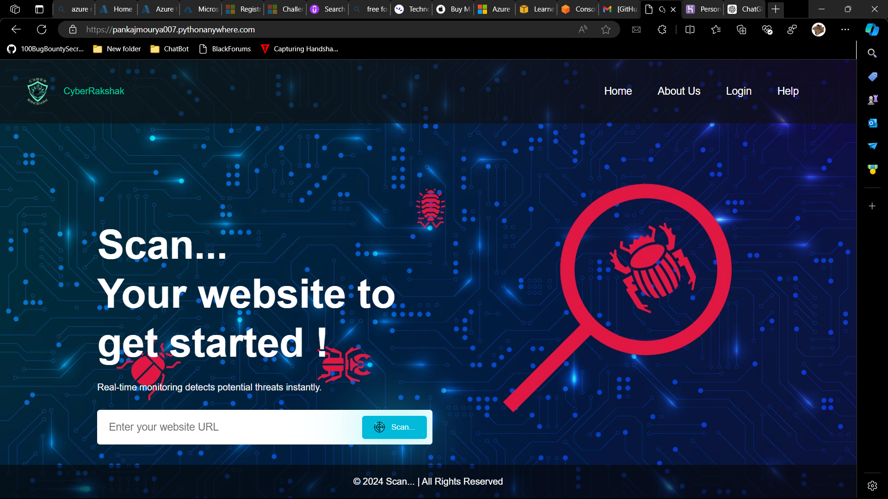
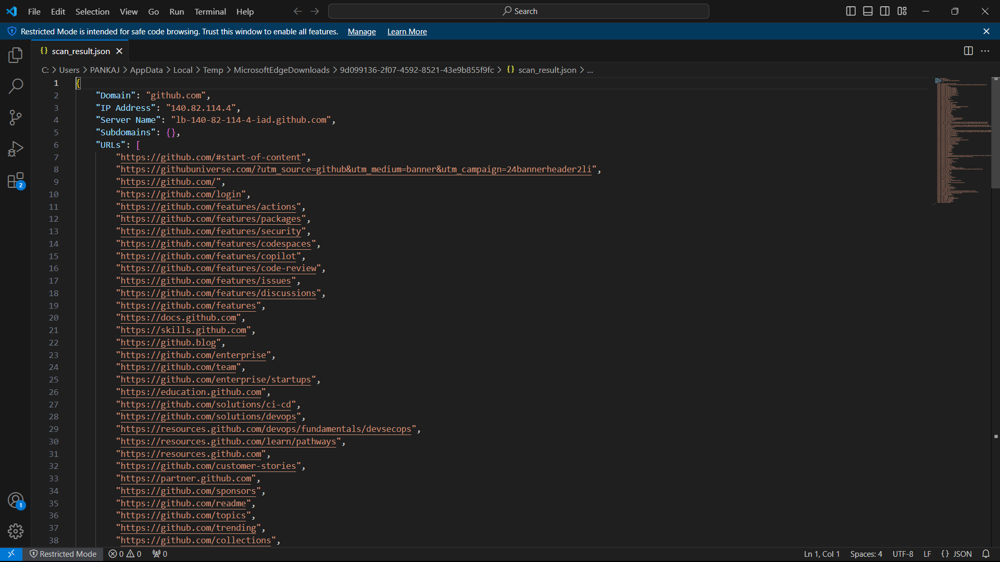

# CyberRakshak

Welcome to the CyberRakshak project! This project is a web application designed to [describe the purpose or functionality of your project here].

## Access the Application

[](https://pankajmourya007.pythonanywhere.com/)

## Project Description

CyberRakshak is designed to [describe what your app does, e.g., monitor cybersecurity threats, provide educational resources, etc.]. It includes features like [list some key features of your application].

## Features

- **User Authentication**: Secure login and registration system.
- **Dashboard**: Overview of key metrics and information.
- **Real-time Alerts**: Receive notifications about important events.
- **Reports**: Generate and view detailed reports.
- **Educational Resources**: Access tutorials and guides on cybersecurity.

## Screenshots

### User Interface


### Scan Result Output


## Installation

To run this project locally, follow these steps:

1. Clone the repository:
   ```bash
   git clone https://github.com/pankajmourya007/CyberRakshak.git
   ```

2. Navigate to the project directory:
   ```bash
   cd CyberRakshak
   ```

3. Create and activate a virtual environment:
   ```bash
   virtualenv venv --python=python3.9
   source venv/bin/activate
   ```

4. Install dependencies:
   ```bash
   pip install -r requirements.txt
   ```

## Usage

To start the application, run:
```bash
python server.py
```
Then open your web browser and go to `http://localhost:5000` to access the application.

## Deployment

The application is deployed on PythonAnywhere and can be accessed at [https://pankajmourya007.pythonanywhere.com/](https://pankajmourya007.pythonanywhere.com/).

## Contributing

Contributions are welcome! If you'd like to contribute, please fork the repository and use a feature branch. Pull requests are warmly welcome.

## License

This project is licensed under the MIT License - see the LICENSE.md file for details.

## Contact

For any inquiries or feedback, please contact pankaj2k21mourya007@gmail.com.
```

Ensure you move the images to the `assets/images/` directory in your repository and rename them accordingly before using the updated README.
